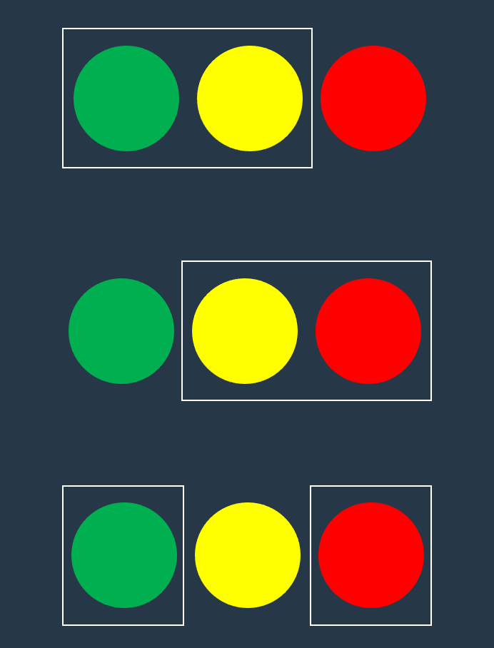
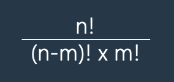

# 구슬을 나누는 경우의 수

[코딩테스트 연습 - 구슬을 나누는 경우의 수][1] 로 이동

## 문제 설명

머쓱이는 구슬을 친구들에게 나누어주려고 합니다. 구슬은 모두 다르게 생겼습니다. 머쓱이가 갖고 있는 구슬의 개수 `balls`와 친구들에게 나누어 줄 구슬 개수 share이 매개변수로 주어질 때, `balls`개의 구슬 중 share개의 구슬을 고르는 가능한 모든 경우의 수를 return 하는 solution 함수를 완성해주세요.

## 제한사항

1 ≤ `balls` ≤ 30

- 1 ≤ share ≤ 30
- 구슬을 고르는 순서는 고려하지 않습니다.
- share ≤ `balls`

## 입출력 예

| balls | share | result |
| ----- | ----- | ------ |
| 3     | 2     | 3      |
| 5     | 3     | 10     |

## 입출력 예 설명

입출력 예 #1

- 서로 다른 구슬 3개 중 2개를 고르는 경우의 수는 3입니다.
  

입출력 예 #2

- 서로 다른 구슬 5개 중 3개를 고르는 경우의 수는 10입니다.

## Hint

- 서로 다른 n개 중 m개를 뽑는 경우의 수 공식은 다음과 같습니다.
  

## 풀이

공식은 본문에 나와있으므로, math 모듈의 팩토리얼을 이용해서 쉽게 풀 수 있다.

```python
from math import factorial


def solution(balls, share):
    return factorial(balls) / (factorial(balls - share) * factorial(share))
```

[1]: https://school.programmers.co.kr/learn/courses/30/lessons/120840
