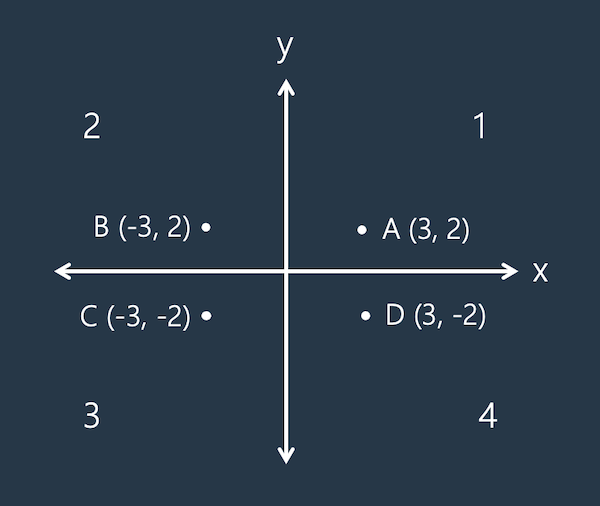

# 점의 위치 구하기

[코딩테스트 연습 - 점의 위치 구하기][1] 로 이동

## 문제 설명

사분면은 한 평면을 x축과 y축을 기준으로 나눈 네 부분입니다. 사분면은 아래와 같이 1부터 4까지 번호를매깁니다.



- x 좌표와 y 좌표가 모두 양수이면 제1사분면에 속합니다.
- x 좌표가 음수, y 좌표가 양수이면 제2사분면에 속합니다.
- x 좌표와 y 좌표가 모두 음수이면 제3사분면에 속합니다.
- x 좌표가 양수, y 좌표가 음수이면 제4사분면에 속합니다.

x 좌표 (x, y)를 차례대로 담은 정수 배열 `dot`이 매개변수로 주어집니다. 좌표 `dot`이 사분면 중 어디에 속하는지 1, 2, 3, 4 중 하나를 return 하도록 solution 함수를 완성해주세요.

## 제한사항

- `dot`의 길이 = 2
- `dot[0]`은 x좌표를, `dot[1]`은 y좌표를 나타냅니다
- -500 ≤ `dot`의 원소 ≤ 500
- `dot`의 원소는 0이 아닙니다.

## 입출력 예

| dot     | result |
| ------- | ------ |
| [2, 4]  | 1      |
| [-7, 9] | 2      |

## 입출력 예 설명

입출력 예 #1

- `dot`이 [2, 4]로 x 좌표와 y 좌표 모두 양수이므로 제 1 사분면에 속합니다. 따라서 1을 return 합니다.

입출력 예 #2

- `dot`이 [-7, 9]로 x 좌표가 음수, y 좌표가 양수이므로 제 2 사분면에 속합니다. 따라서 2를 return 합니다.

## 풀이

일반적인 풀이는 다음과 같다.

```python
def solution(dot):
    x, y = dot
    if y > 0:
        return 1 if x > 0 else 2
    else:
        return 4 if x > 0 else 3
```

다음과 같이 코드를 줄일 수 있지만 가독성이 안좋아진다.
그러므로 첫번째 것을 쓴다.

```python
def solution(dot):
    x, y = dot
    return [[3, 2], [4, 1]][x > 0][y > 0]
```

[1]: https://school.programmers.co.kr/learn/courses/30/lessons/120841
